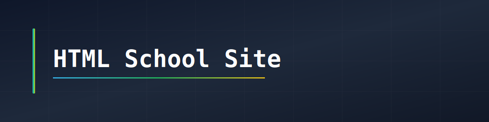

# HTML School Site

## Descrizione

Questo progetto è un rifacimento del sito web dell’istituto scolastico realizzato con HTML5 e CSS3.
L’obiettivo è rendere il sito più moderno, ordinato e facile da navigare, migliorando la struttura e la leggibilità dei contenuti.
Le immagini utilizzate nel sito sono caricate da fonti online.

## Come utilizzare il progetto

1. Scaricare o clonare il repository sul proprio computer
2. Aprire la cartella del progetto
3. Fare doppio clic sul file `index.html`
4. Il sito si aprirà automaticamente nel browser
Non è necessario installare programmi aggiuntivi.

## Obiettivi del progetto

- Migliorare l’aspetto grafico del sito
- Rendere la navigazione più semplice
- Creare una struttura più ordinata
- Rendere il sito responsive per dispositivi diversi
